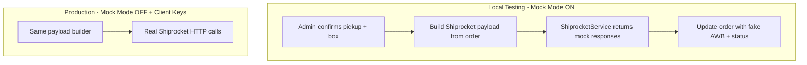

# Shiprocket Admin Integration Plan (Local Testing First)

## Goal

Implement **everything now** so you can test locally, but **without real Shiprocket credentials** and **without placing real orders** until your client provides API keys.

When credentials arrive later: set `.env` keys and turn mock mode off — no code rewrite needed.

## Local testing strategy

Add a **mock mode** that short-circuits live HTTP calls:

```php
// config/services.php
'shiprocket' => [
    'base_url' => env('SHIPROCKET_BASE_URL', 'https://apiv2.shiprocket.in/v1/external'),
    'email' => env('SHIPROCKET_EMAIL'),
    'password' => env('SHIPROCKET_PASSWORD'),
    'default_weight' => env('SHIPROCKET_DEFAULT_WEIGHT', 0.5),
    'mock_mode' => env('SHIPROCKET_MOCK_MODE', true), // true for local until client gives keys
],
```

**Mock mode ON** (default for local):
- No outbound calls to Shiprocket
- Returns realistic fake responses for auth, pickup locations, create order, serviceability, AWB, pickup, tracking
- Full admin UI flow works: select pickup + box → confirm → order updated with fake AWB + shiprocket fields
- Lets you verify payload mapping, validation, DB writes, cron logic, and error handling

**Mock mode OFF** (production / after client gives keys):
- Real HTTP calls to official Shiprocket endpoints
- Actual orders placed on Shiprocket account

**Missing credentials guard:** If `SHIPROCKET_EMAIL` or `SHIPROCKET_PASSWORD` is empty and mock mode is off, return a clear admin error: *"Shiprocket credentials not configured. Enable mock mode for local testing or add client API keys."*

## What you can test locally (no client keys needed)

| Feature | Mock mode behavior |
|---|---|
| Shipping config UI | Form renders; saving credentials to `.env` works when you have keys |
| Pickup address + box size selection on order page | Works against local DB |
| Confirm Shiprocket shipment | Builds real payload, runs mock API chain, saves order |
| Order fields updated | `shipping_method`, `pickup_address_id`, `shiprocket_*`, `tracking_code`, `delivery_status` |
| Delivery status cron | Uses mock tracking response to update order status |
| Payload preview (dev route) | See exact JSON that would be sent to Shiprocket without posting |

## What waits for client credentials

| Feature | Requires live mode + real keys |
|---|---|
| Real Shiprocket order creation | `POST /orders/create/adhoc` |
| Real AWB assignment | `POST /courier/assign/awb` |
| Real pickup request | `POST /courier/generate/pickup` |
| Live tracking sync | `GET /courier/track/shipment/{id}` |

## Current state (unchanged gaps)

| Piece | Status |
|---|---|
| [`app/Services/ShiprocketService.php`](app/Services/ShiprocketService.php) | Partial; hardcoded values, missing endpoints |
| [`app/Http/Controllers/ShiprocketController.php`](app/Http/Controllers/ShiprocketController.php) | Missing `update`, `createOrderShiprocket`, `deliveryStatus` |
| [`routes/shiprocket.php`](routes/shiprocket.php) | Routes defined but controller methods missing |
| [`resources/views/backend/shipping_system/partials/shiprocket.blade.php`](resources/views/backend/shipping_system/partials/shiprocket.blade.php) | **Missing** |
| [`config/services.php`](config/services.php) | No shiprocket block |
| Public routes in [`routes/web.php`](routes/web.php) | Insecure test endpoints |



## Official APIs to implement in `ShiprocketService`

Base URL: `https://apiv2.shiprocket.in/v1/external`

| Method | Endpoint | Mock? | Notes |
|---|---|---|---|
| `getToken()` | `POST /auth/login` | Yes | Returns fake token locally |
| `getPickupLocations()` | `GET /settings/company/pickup` | Yes | Fake pickup with configurable pin |
| `createAdhocOrder()` | `POST /orders/create/adhoc` | Yes | **No real order placed in mock** |
| `checkServiceability()` | `GET /courier/serviceability/` | Yes | Fake courier list |
| `assignAwb()` | `POST /courier/assign/awb` | Yes | Uses `courier_id` param |
| `requestPickup()` | `POST /courier/generate/pickup` | Yes | Fake pickup scheduled |
| `trackShipment()` | `GET /courier/track/shipment/{id}` | Yes | Fake status progression for cron |

Each method: shared `request()` helper → if `mock_mode` or missing credentials → return mock; else → live HTTP.

## Implementation steps

### 1. Configuration + settings UI

- Add shiprocket block to [`config/services.php`](config/services.php) (include `mock_mode`)
- Add to [`.env.example`](.env.example) with **empty placeholders** (no real secrets):

```env
SHIPROCKET_BASE_URL=https://apiv2.shiprocket.in/v1/external
SHIPROCKET_EMAIL=
SHIPROCKET_PASSWORD=
SHIPROCKET_DEFAULT_WEIGHT=0.5
SHIPROCKET_MOCK_MODE=true
```

- Create [`resources/views/backend/shipping_system/partials/shiprocket.blade.php`](resources/views/backend/shipping_system/partials/shiprocket.blade.php):
  - Email, password (optional until client provides)
  - Default weight
  - Mock mode toggle (visible warning: "Enable for local testing without API keys")
- Implement `ShiprocketController::update()` to save settings to `.env` via `overWriteEnvFile()`

### 2. Refactor `ShiprocketService`

Expand [`app/Services/ShiprocketService.php`](app/Services/ShiprocketService.php):

- Private `isMockMode(): bool`
- Private `request($method, $uri, $data)` with mock/live branching
- Private mock response factories per endpoint (realistic structure matching Postman examples)
- All public API methods listed above
- Fix bugs: remove hardcoded pincode `110016`, use `courier_id` in AWB body, validate empty courier list

### 3. Order payload builder

Private method in controller (or helper) — **always runs in both mock and live mode** so you can verify mapping:

| Shiprocket field | Local source |
|---|---|
| `order_id` | `$order->code` or `"ORD-{$order->id}"` |
| `order_date` | `$order->created_at` → `Y-m-d H:i` |
| `pickup_location` | `$pickupAddress->address_nickname` |
| Billing/shipping | `billing_address` / `shipping_address` JSON |
| `order_items[]` | `order_details` + `products`; real SKU when available |
| `payment_method` | `COD` or `Prepaid` from `$order->payment_type` |
| `sub_total` | `$order->grand_total` |
| Dimensions | `shipping_box_sizes` length/breadth/height |
| `weight` | config default |

In mock mode: skip live pickup lookup; use a fake pincode (e.g. `110001`) or read from config `SHIPROCKET_MOCK_PICKUP_PINCODE`.

### 4. Controller methods

Update [`app/Http/Controllers/ShiprocketController.php`](app/Http/Controllers/ShiprocketController.php):

**`createOrderShiprocket(Request $request)`**
1. Validate inputs
2. Build payload (always)
3. If mock → run mock API chain; if live → real API chain
4. Update order DB fields
5. Return JSON `{ success, message, mock: true/false, payload? }` for debugging

**`deliveryStatus()`**
- Process Shiprocket orders; in mock mode simulate status progression (e.g. confirmed → picked_up → on_the_way)

**`update(Request $request)`**
- Save settings to `.env`

**`previewPayload($orderId)`** (admin dev helper)
- Returns the JSON payload that would be sent — no API call, no DB change

Remove/refactor old public `createOrder()` test method.

### 5. Routes

**Remove** from [`routes/web.php`](routes/web.php):
- Unauthenticated `/shiprocket/token`
- Unauthenticated `/orders/{id}/create-shipment`

**Add** to [`routes/shiprocket.php`](routes/shiprocket.php) (admin + auth):
- Existing: `update`, `createOrderShiprocket`, `deliveryStatus`
- New dev helper: `GET /shiprocket/preview-payload/{order}` → preview payload for testing

### 6. Local test checklist (no client keys)

1. Set `SHIPROCKET_MOCK_MODE=true` in `.env` (email/password can stay empty)
2. Enable Shiprocket addon + shipping system in admin
3. Create pickup address nickname (e.g. `work-1`) and box size
4. Open pending order → select Shiprocket → confirm
5. Verify order gets mock AWB, `shipping_method=shiprocket`, status updated
6. Hit `/admin/shiprocket/delivery-status` → verify cron updates mock tracking status
7. Hit `/admin/shiprocket/preview-payload/{orderId}` → inspect payload JSON

### 7. When client provides keys (later)

1. Set `SHIPROCKET_EMAIL` and `SHIPROCKET_PASSWORD` in `.env`
2. Set `SHIPROCKET_MOCK_MODE=false`
3. Ensure pickup address nicknames match Shiprocket panel
4. Re-test confirm shipment → real order placed

## Files to change

| File | Change |
|---|---|
| [`config/services.php`](config/services.php) | Shiprocket config + mock_mode |
| [`.env.example`](.env.example) | Empty placeholder keys + mock mode default |
| [`app/Services/ShiprocketService.php`](app/Services/ShiprocketService.php) | Full API client + mock responses |
| [`app/Http/Controllers/ShiprocketController.php`](app/Http/Controllers/ShiprocketController.php) | All methods + payload builder + mock/live branch |
| [`resources/views/backend/shipping_system/partials/shiprocket.blade.php`](resources/views/backend/shipping_system/partials/shiprocket.blade.php) | **New** settings form with mock toggle |
| [`routes/shiprocket.php`](routes/shiprocket.php) | Add preview-payload dev route |
| [`routes/web.php`](routes/web.php) | Remove insecure public routes |

## Out of scope (future)

- Return/exchange APIs, bulk import, label PDF
- `weight` column on `shipping_box_sizes`
- Auto-cancel on local order cancel
